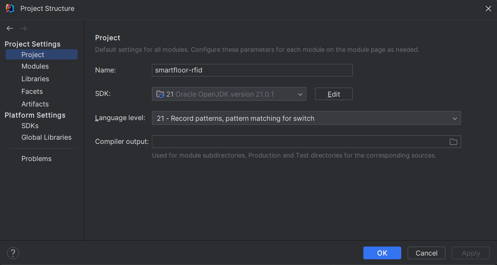
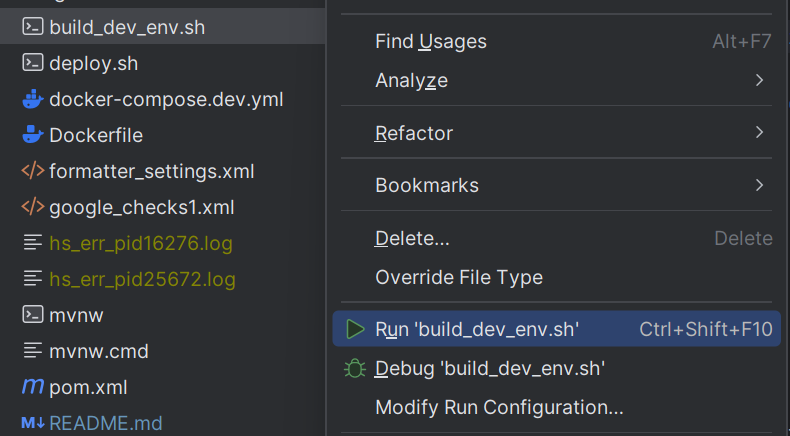
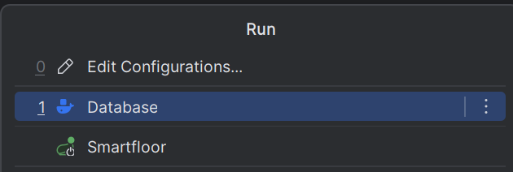
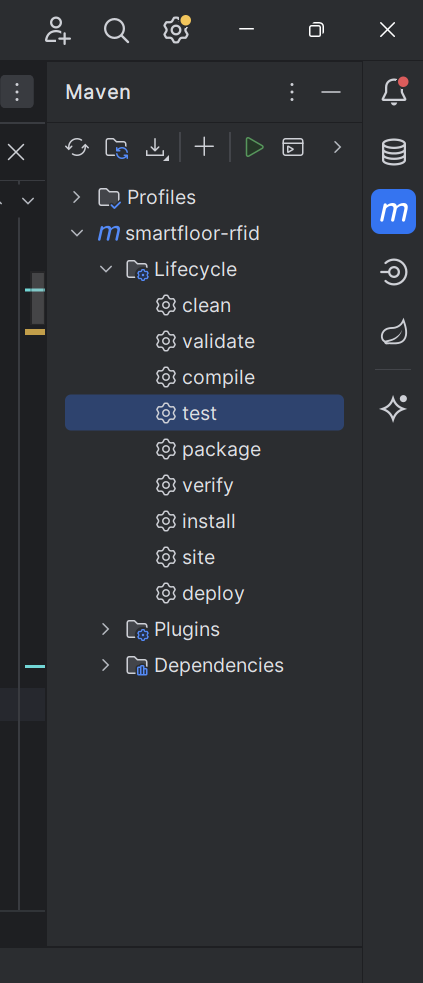
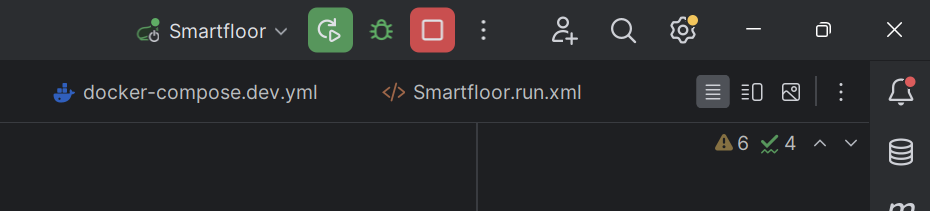
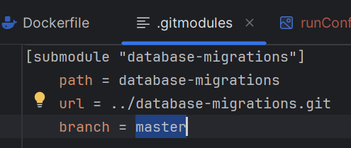

# README #

This project houses the code and configuration for the API service. It consists of a Spring Boot
project with various dependencies.

## Prerequisites ##

* [Java SE Development Kit](https://www.oracle.com/java/technologies/downloads/#java21) (At the time of writing, JDK 21)
* [Docker Desktop](https://www.docker.com/products/docker-desktop/)
* [Maven](https://maven.apache.org/download.cgi)

After installing those:

1. Clone the repository
2. Run `git submodule update --init --recursive` to fetch all database migrations. They are in a separate git repo and
   referenced by this project as a [submodule](https://git-scm.com/book/en/v2/Git-Tools-Submodules).

## Running the application ##

Before running the application make sure:

1. Docker Desktop is running.
2. IntelliJ uses the correct SDK. This needs to be set up only once. To check that, go
   to `File > Project structure > Project` and select an SDK and Language level, corresponding to the Java version of
   the app. Currently, this is 21:
   

There are two ways to run the app - from the IDE and from
Docker. [This](https://smartfloor.atlassian.net/wiki/spaces/VIT/pages/57475073/Development+workflows) page explains in
detail what the difference between both approaches is, and the sections below are just a summary.

### Running with Docker ###

You can run the application by running the file `build_dev_env.sh` situated in the project root folder by
right-clicking it and selecting `Run 'build_dev_env.sh'`:

The script creates Docker containers for the database and the app itself. It runs for quite a while, since it also
executes multiple unit and integration tests, but once the containers are running and the script stops logging new
lines, the app is ready to be used.

### Running with IntelliJ ###

This approach uses Docker only to host the database. The application is executed through the IDE as a Spring Boot app.
This way of running the application is much faster since it does not execute all tests before that.

1. Go to `Run > Run...`. This displays two IntelliJ configurations we have - one that starts the database (`Database`)
   and one that starts the app (`Smartfloor`).

2. Select the Database configuration first. Wait until the `flyway` and `smartfloor-db` containers have started.
3. Go to `Run > Run` again and select the Smartfloor configuration this time.

## Formatting and linting ##

To set up your IDE with a formatter, go through
our [Linting & formatting guide](https://smartfloor.atlassian.net/wiki/spaces/VIT/pages/81526803/IDE+setup).

## Testing ##

There are two ways to test the app - by running the unit and integration tests, or by manual tests with the
web application. Doing both is recommended, especially when developing more complex features.

### Running unit and integration tests ###

Running all tests can be done by running the Maven `test` script from
IntelliJ as shown below:

Regardless of whether you are running one or all tests, **Docker Desktop must be running**.

### Manual testing ###

Manual testing can be performed by locally running this application and web-vitality. Make sure to start the web
application with the command `npm run start:local`. This will force the web app to send requests to localhost (your
local instance of cloud-api).

When making a change in the code of cloud-api during development, the change will not be available immediately. If you
are running the app in the IDE, you will need to reload it:

If you are running the app with the script, you will need to re-run it. The script also runs a linter and all unit and
integration tests before building the app. If the linter or any tests fail, the build will fail too, so if you want to
test some very simple changes (such as logging), it is much faster to just run the app from the IDE.

When you run the web and cloud-api applications for the first time, the Vitality website will be infinitely loading.
This is because the authenticated user (in the development environment this is the user with ID=1) has access to
no [applications](https://smartfloor.atlassian.net/wiki/spaces/VIT/pages/19431447/The+entities#Application). To fix
this, you could run some SQL against the local DB. Next section explains how to connect to that local DB.

## Configuring a data source ##

1. Make sure Docker Desktop is on and that the `smartfloor-rfid` containers are running
2. Find the `Database` tab in the sidebar
3. Click `+` => `Data source` => `PostgreSQL`
4. Fill the form like so

> Name: smartfloor@localhost  
> Host: localhost  
> Port: 5432  
> Authentication: User & Password  
> User: postgres  
> Password: dev  
> Database: smartfloor

5. Confirm and open a console to run SQL statements against the local DB

Note: If you don't have an IntelliJ license, you could
install [this DB Explorer plugin for IntelliJ](https://plugins.jetbrains.com/plugin/1800-database-navigator).

## Working with migrations ##

### A few general guidelines ###

1. <b>Never edit an existing migration, because a migration never runs more than once.</b> If a column needs to be
   deleted, we need a new migration that drops that column.
2. <b>New migrations cannot be pushed through the submodule.</b> You need to clone the `database-migrations` project and
   work in it. From there, you go through the usual development flow - the new migration is added on a feature branch,
   the feature branch is merged to development, development is merged to master. When the new migration is merged to
   master, it becomes available to cloud-api (explained why in next step).
3. This project references the database-migrations project by its master branch, as seen from the image below. Whenever
   a new migration is available on the master branch of the database-migrations repository, we need to update the
   reference to the migrations project from this project too, otherwise it will still be pointing at a commit prior to
   the one that introduces the change that we need. To do that, from the root of this project we need to
   run `git submodule update --remote`.

### Practical example: Working on a "full-stack" feature ###

If you are working on a feature that requires changes in cloud-api and a new migration (and possibly changes in the
web-application too),
[this](https://smartfloor.atlassian.net/wiki/spaces/VIT/pages/111411201/Practical+example+Working+on+a+full-stack+feature)
page provides a practical example of working on all three projects at the same time.
